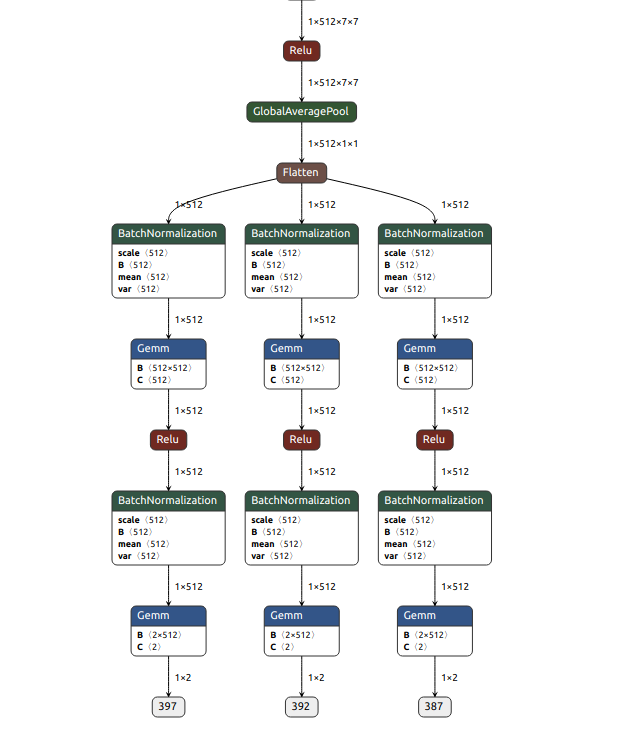

# 多任务学习
## 多任务分类
- 本repo实现的是分类头， 如涉黄识别头
- 代码开源， 数据非开源

## 训练策略
- 当多个任务， 每个数据都有准确的标签时， 可以尝试先训练任务头，再解冻整体训练
- 直接训练各个任务头， 整数据集训练
- 依次训练各个任务头， 分数据

## 损失函数
- 论文[Multi-Task Learning Using Uncertainty to Weigh Losses for Scene Geometry and Semantics](https://arxiv.org/abs/1705.07115)
- 代码中已经加入参数监督，若可学习权重没有更新， 使用add_param_group将该权重加入学习

## 任务头结构



## how to use
- 标签制作
    ```bash
    python mtl/data_analysis.py
    ```
- 多任务一起训练
    ```bash
    python mtl/main.py /data2/rzhang/mtl_data \
        --epochs 200 \
        --train_head \
        --gpu 1
    ```
- 各个任务头单独训练
    ```bash
    python mtl/main_separate.py /data2/rzhang/mtl_data \
    --epochs 200 \
    --head 1 \
    --gpu 1

    python mtl/main_separate.py /data2/rzhang/mtl_data \
        --epochs 200 \
        --head 2 \
        --gpu 1 \
        --load_from work_dir/model_best_head1.pth

    python mtl/main_separate.py /data2/rzhang/mtl_data \
        --epochs 200 \
        --head 3 \
        --gpu 1 \
        --load_from work_dir/model_best_head2.pth
    ```
- export onnx
    ```bash
    python mtl/test.py --task export \
        --ckpt work_dir_bak/model_best.pth
    ```
- predict
    ```bash
    python mtl/test.py --task predict \
        --ckpt work_dir/model_best.pth \
        --data test_data
    ```
- eval
    ```bash
    python mtl/test.py --task eval \
        --ckpt work_dir_bak/model_best.pth \
        --gpu 1 \
        --data /data2/rzhang/mtl_data
    ```

## reference
- [Multi-Task Learning with Pytorch and FastAI](https://towardsdatascience.com/multi-task-learning-with-pytorch-and-fastai-6d10dc7ce855)